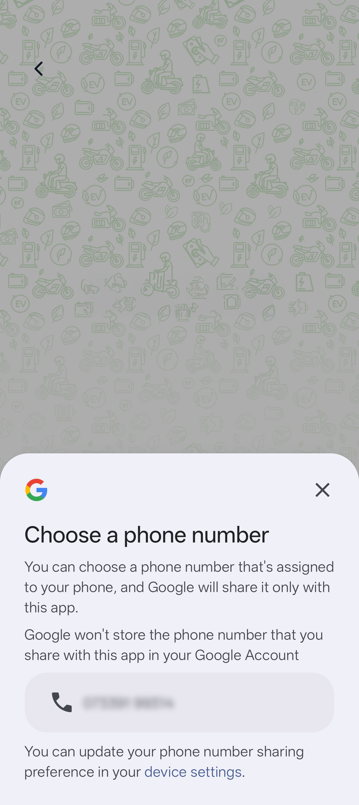

# expo-phone-number-hint-autofill

Expo module for Google Play Services Phone Number Hint API that allows users to retrieve their phone number on Android devices with user consent.

## Preview

### 📱 User Experience
<p align="center">
  
</p>

### 💻 Code Preview
```javascript
import { requestPhoneNumberHint } from 'expo-phone-number-hint-autofill';

const handleGetPhoneNumber = async () => {
  const result = await requestPhoneNumberHint();
  
  if (result.success) {
    // Phone number retrieved: "+1234567890"
    console.log('Phone number:', result.phoneNumber);
  }
};
```

*Simple, clean API that returns the user's phone number in just 3 lines of code*

## Features

- 🔒 Privacy-first - Requires explicit user consent
- 📱 Android-only - Uses Google Play Services Phone Number Hint API
- ⚡ Easy to use - Simple Promise-based API
- 🎯 Expo managed and bare workflow support

## Installation

```bash
expo install expo-phone-number-hint-autofill
```

## Usage

```javascript
import { requestPhoneNumberHint } from 'expo-phone-number-hint-autofill';

const handleGetPhoneNumber = async () => {
  try {
    const result = await requestPhoneNumberHint();
    
    if (result.success) {
      console.log('Phone number:', result.phoneNumber);
      // Use the phone number (e.g., pre-fill a form)
    } else {
      console.error('Error:', result.error);
    }
  } catch (error) {
    console.error('Unexpected error:', error);
  }
};
```

## API

### `requestPhoneNumberHint()`

Requests the user's phone number using Google Play Services Phone Number Hint API.

**Returns:** `Promise<PhoneNumberHintResult>`

#### PhoneNumberHintResult

```typescript
interface PhoneNumberHintResult {
  phoneNumber: string;  // The retrieved phone number (empty if failed)
  success: boolean;     // Whether the operation was successful
  error?: string;       // Error message if failed
}
```

## Platform Support

- ✅ Android
- ❌ iOS (Phone Number Hint API is Android-only)

## Requirements

- Android API level 26+
- Google Play Services

# API documentation

- [Documentation for the latest stable release](https://docs.expo.dev/versions/latest/sdk/phone-number-hint-autofill/)
- [Documentation for the main branch](https://docs.expo.dev/versions/unversioned/sdk/phone-number-hint-autofill/)

# Installation in managed Expo projects

For [managed](https://docs.expo.dev/archive/managed-vs-bare/) Expo projects, please follow the installation instructions in the [API documentation for the latest stable release](#api-documentation). If you follow the link and there is no documentation available then this library is not yet usable within managed projects &mdash; it is likely to be included in an upcoming Expo SDK release.

# Installation in bare React Native projects

For bare React Native projects, you must ensure that you have [installed and configured the `expo` package](https://docs.expo.dev/bare/installing-expo-modules/) before continuing.

### Add the package to your npm dependencies

```
npm install expo-phone-number-hint-autofill
```

### Configure for Android

The module will automatically link when you build your app. No additional configuration is required.

# Contributing

Contributions are very welcome! Please refer to guidelines described in the [contributing guide]( https://github.com/expo/expo#contributing).
